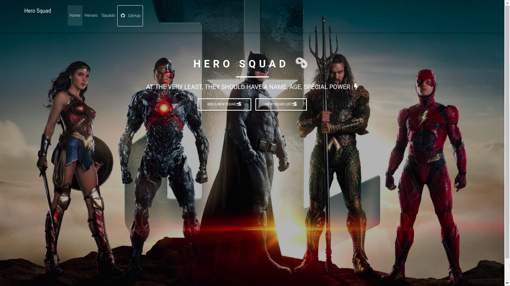

# Hero Squad


## Author
GLEN MBOROKI

## heroku link
https://dashboard.heroku.com/apps/glen-hero

## TOC

- [Installation](#Installation)
- [Live Demo](#Tests)
- [Tests](#Tests)
- [Requirements](#Requirements)
- [Known Bugs](#Extras)
- [Extras](#Extras)

## Description

```bash
HeroSquad is a web app app built using java-spark framework it allows one to recruit a well-balanced team of superheroes,
where at the very least, they should have a name, age, special power and weakness.
The heroes should also have a max size, name, and a cause
a hero can only participate in one Squad at a time.
```

## Tests

- To run test, run files under tests/java package for tests.


## User Requirements
```bash
The applications allow users to do the following:
1.Add a new squad
2.Add a new hero in the squad
3.Add a squad name , size and a cause
4.View a list of current squads
3.View a list of heros in a squad

```


## Known Bugs
it takes a little bit of time to react to a command.

## Contact Details
```bash
You can contact me at glnmboroki@gmail.com
```

## License

- This project is licensed under the MIT Open Source license Copyright (c) 2022  by GLEN MBOROKI
